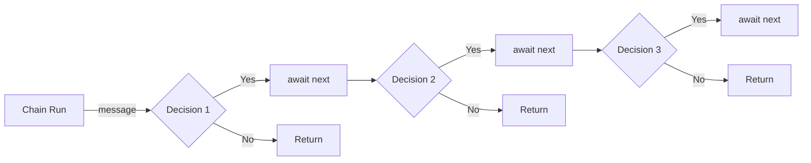

Here's the updated `README` with the additional example for building in-line:

# EasyChain

`EasyChain` is a lightweight .NET library designed for implementing the Chain of Responsibility pattern. It enables you to define a sequence of handlers to process messages in a flexible and decoupled manner.

<p align="left">
  <a href="https://github.com/cleberMargarida/easy-chain/actions/workflows/workflow.yml">
    
  </a>
  <a href="https://www.nuget.org/packages/EasyChain">
    
  </a>  
  <a href="https://github.com/cleberMargarida/easy-chain/actions/runs/10553862586#summary-29234823720">
    
  </a>
</p>

## Chain of Responsibility

A lightweight and straightforward library for implementing the chain of responsibility pattern. 
Take a look at [Source Making - Chain of Responsibility](https://sourcemaking.com/design_patterns/chain_of_responsibility).



## Features

- **.NET Standard Support**: Compatible with all .NET applications, including .NET Core, .NET 5, .NET 6, .NET 7, .NET 8, and .NET 9.
- **Integration with Dependency Injection**: Fully supports `Microsoft.Extensions.DependencyInjection`, including various lifetime options.
- **Fluent API**: Define and configure chains of handlers using a simple and expressive fluent API.
- **Asynchronous Processing**: Handles messages asynchronously.
- **Runtime Compilation**: Uses `System.Linq.Expressions` to compile methods dynamically at runtime, ensuring no code is embedded between your handlers.
- **Ease of Use**: Extremely straightforward to set up and use.

## Installation

To install `EasyChain`, add the following package to your project via NuGet:

```bash
dotnet add package EasyChain
```

## Usage

Here's a quick example to get you started:

### 1. Define Your Chain
```csharp
class CarChain : IChainConfig<Car>
{
    public void Configure(IChainBuilder<Car> callChain)
    {
        callChain.SetNext<CarYearHandler>()
                 .SetNext<CarModelHandler>();
    }
}

class CarYearHandler : IHandler<Car>
{
    public async Task Handle(Car message, ChainHandling<Car> next)
    {
        if (message.Year > 1960)
            await next(message);
    }
}

class CarModelHandler : IHandler<Car>
{
    public async Task Handle(Car message, ChainHandling<Car> next)
    {
        if (message.Model == "FooModel")
            await next(message);
    }
}
```

### 2. Register the Chain
```csharp
builder.Services.AddChain<CarChain>();
```

### 3. Run the Chain
```csharp
IChain<Car> chain = app.Services.GetService<IChain<Car>>();

var message = new Car
{
    Model = "FooModel",
    Year = 2024,
};

await chain.Run(message);
```

### 4. Forking Example

EasyChain allows you to fork the chain into multiple branches and merge them back later:

```csharp
class CarChain : IChainConfig<Car>
{
    public void Configure(IChainBuilder<Car> callChain)
    {
        callChain.SetNext<CarYearHandler>()
                 .Fork((left, right) =>
                 {
                     left.SetNext<EngineSizeHandler>();
                     right.SetNext<CarModelHandler>();
                 })
                 .Merge()
                 .SetNext<CarPriceHandler>();
    }
}
```

In this example:
- The chain forks after `CarYearHandler` into two branches: one continues with `EngineSizeHandler`, and the other with `CarModelHandler`.
- After the fork, the branches are merged, and the chain continues with `CarPriceHandler`.

### 5. Building In-Line

You can also build your chain in-line using the `CreateBuilder` method:

```csharp
var chain = Chain<object>.CreateBuilder()
                         .SetNext<TestHandler>()
                         .SetNext<TestHandler2>()
                         .Build();
```

In this example, the chain is configured and built in a single statement, allowing for concise and clear setup.

## License

This project is licensed under the MIT License - see the [LICENSE](https://github.com/git/git-scm.com/blob/main/MIT-LICENSE.txt) file for details.

## Contact

For any questions or support, please reach out to cleber.margarida@outlook.com
