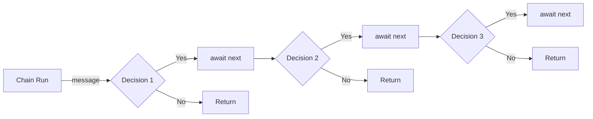

# EasyChain

`EasyChain` is a lightweight .NET library designed for implementing the Chain of Responsibility pattern. It enables you to define a sequence of handlers to process messages in a flexible and decoupled manner.

## Features

- **.NET Standard Support**: Compatible with all .NET applications, including .NET Core, .NET 5, .NET 6, .NET 7, .NET 8, and .NET 9.
- **Integration with Dependency Injection**: Fully supports `Microsoft.Extensions.DependencyInjection`, including various lifetime options.
- **Fluent API**: Define and configure chains of handlers using a simple and expressive fluent API.
- **Asynchronous Processing**: Handles messages asynchronously.
- **Runtime Compilation**: We make usage `System.Linq.Expressions` to compile methods dynamically at runtime, ensuring no code is embedded between your handlers.
- **Ease of Use**: Extremely straightforward to set up and use.

## Installation

To install `EasyChain`, add the following package to your project via NuGet:

```bash
dotnet add package EasyChain
```

## Usage
Here's a quick example to get you started:

The diagram below provides a high-level view of how the chain operates:


1. Define Your Chain
  ```csharp
  class CarChain : IChainBuilder<Car>
  {
      public void Configure(IChainConfig<Car> callChain)
      {
          callChain.Add<CarYearHandler>();
          callChain.Add<CarModelHandler>();
      }
  }

  class CarYearHandler : IHandler<Car>
  {
      public async Task Handle(Car message, ChainHandling<Car> next)
      {
          if (message.Year > 1960)
              await next(message);
      }
  }
  
  class CarModelHandler : IHandler<Car>
  {
      public async Task Handle(Car message, ChainHandling<Car> next)
      {
          if (message.Model == "FooModel")
              await next(message);
      }
  }
  ```
2. Register the Chain
  ```csharp
  builder.Services.AddChain<CarChain>();
  ```
3. Run the Chain
  ```csharp
  IChain<Car> chain = app.Services.GetService<IChain<Car>>();

  var message = new Car
  {
      Model = "FooModel",
      Year = 2024,
  };
  
  await chain.Run(message);
  ```

# License
This project is licensed under the MIT License - see the LICENSE file for details.

# Contact
For any questions or support, please reach out to cleber.margarida@outlook.com.
